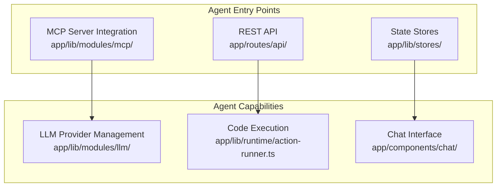
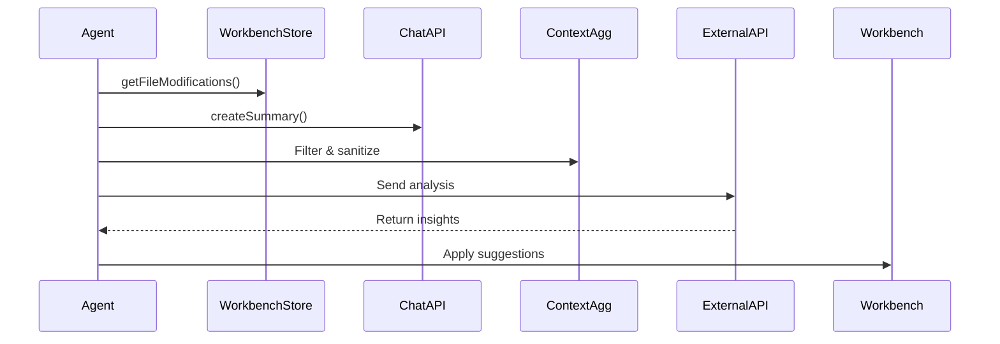

# Agents Guide to bolt.diy

## 🤖 Agent Orientation

bolt.diy is an AI-powered full-stack web development platform running entirely in the browser. As an agent, you can interact with this codebase through multiple integration points to analyze, modify, or extend the platform.

### Core Architecture for Agents



## 🔌 Agent Integration Points

### 1. MCP (Model Context Protocol) Integration

**Location**: `app/lib/modules/mcp/`

Register as an MCP server to expose tools:

```json
{
  "mcpServers": {
    "your-agent": {
      "type": "streamable-http",
      "url": "https://your-agent-endpoint.com/mcp",
      "headers": {
        "Authorization": "Bearer ${YOUR_API_KEY}"
      }
    }
  }
}
```

### 2. Context Sharing API

**Key Methods**:

- `WorkbenchStore.getFileModifications()` - Get file diffs
- `WorkbenchStore.getModifiedFiles()` - List changed files
- `WorkbenchStore.downloadZip()` - Package project as ZIP
- `createSummary()` - Summarize chat history
- `selectContext()` - Select relevant files

### 3. LLM Provider System

**Base Class**: `app/lib/modules/llm/base-provider.ts`

Add new LLM providers by extending `BaseProvider`:

```typescript
class YourProvider extends BaseProvider {
  static staticModels = [...]
  async getDynamicModels() {...}
  getModelInstance(model) {...}
}
```

## 🛠️ Available Agent Tools

### Current Tool Landscape:

| Category | Count | Examples |
|----------|-------|----------|
| LLM Providers | 19 | OpenAI, Anthropic, Google, Ollama |
| MCP Transports | 3 | stdio, sse, streamable-http |
| Action Types | 5 | file, shell, start, build, supabase |
| Git Services | 2 | GitHub, GitLab |
| Deploy Services | 2 | Netlify, Vercel |

### Action Runner Interface

**Location**: `app/lib/runtime/action-runner.ts`

Execute actions through WebContainer:

```typescript
// File operations
runFileAction({ type: 'file', path: 'src/app.tsx', content: '...' })

// Shell commands
runShellAction({ type: 'shell', command: 'npm install' })

// Start dev server
runStartAction({ type: 'start' })
```

## 📊 Agent Context Access

### State Stores:

- **WorkbenchStore**: Files, editor, terminal, previews
- **ChatStore**: Messages, conversation history
- **ProvidersStore**: LLM provider configurations
- **MCPStore**: MCP server tools and status

### Context Optimization

Reuse existing patterns for efficient context sharing:

- `createSummary()` - Compress chat history
- `selectContext()` - Filter relevant files
- Environment masking - Sanitize secrets

## 🔄 Agent Workflows

### 1. Analysis Workflow



### 2. Development Workflow

1. **Setup**: Clone repo, install dependencies
2. **Configure**: Set up `.env.local` with API keys
3. **Develop**: Run `pnpm run dev`
4. **Test**: Use Chrome Canary for local testing
5. **Integrate**: Register MCP server or extend providers

## 🔒 Security Considerations

### Environment Safety

- Never commit `.env.local` or `.env` files
- Use environment masking for context sharing
- Validate all API keys and tokens

### Code Execution

- All code runs in WebContainer (isolated environment)
- File operations are sandboxed
- Terminal access is controlled

## 📚 Agent-Specific Resources

### Key Files for Agents:

- `app/lib/modules/llm/manager.ts` - LLM provider management
- `app/lib/runtime/action-runner.ts` - Code execution engine
- `app/lib/stores/` - State management
- `app/routes/api.chat.ts` - Chat API endpoint
- `docs/devin-context-sharing-diagrams.md` - Detailed integration diagrams

### Development Commands:

```bash
# Setup
pnpm install
cp .env.example .env.local

# Development
pnpm run dev

# Type checking
pnpm typecheck

# Linting
pnpm lint
```

## 🚀 Getting Started as an Agent

1. **Choose Integration**: MCP server, REST API, or direct store access
2. **Register Tools**: Define your agent's capabilities
3. **Handle Context**: Use existing optimization patterns
4. **Implement Actions**: Extend ActionRunner for new capabilities
5. **Test Integration**: Use the development server

---

*This guide is specifically designed for AI agents interacting with the bolt.diy codebase. For human contributors, see CONTRIBUTING.md.*
