# Bolt.diy Context Sharing with Devin - Architecture Diagrams

This document contains two comprehensive diagrams for integrating context sharing capabilities from the Bolt.diy application state to Devin.

---

## 1. Context Sharing Flowchart

This flowchart illustrates the process of sharing context directly from the Bolt.diy application state with Devin. It details three key phases:
- **Phase 1**: Updating application state (existing)
- **Phase 2**: Context aggregation and triggering (new)
- **Phase 3**: External tool/service interaction

```mermaid
flowchart TD
    %% ============================================
    %% PHASE 1: APPLICATION STATE UPDATES (EXISTING)
    %% ============================================
    subgraph Phase1["Phase 1: Application State Updates (Existing)"]
        direction TB
        
        subgraph UserActions["User Actions"]
            U1[Edit Files]
            U2[Run Shell Commands]
            U3[Send Chat Messages]
            U4[Configure MCP Servers]
            U5[Connect Git/Deploy/DB]
        end
        
        subgraph StateStores["State Management Stores"]
            WB["WorkbenchStore
            ├─ FilesStore (files, modifications)
            ├─ EditorStore (current document)
            ├─ TerminalStore (shell sessions)
            └─ PreviewsStore (live preview URLs)"]
            
            CHAT["Chat State & History
            ├─ chatStore (session state)
            ├─ boltHistory (IndexedDB)
            └─ Messages array"]
            
            MCP["useMCPStore
            ├─ mcpConfig (server definitions)
            ├─ serverTools (discovered tools)
            └─ maxLLMSteps"]
            
            DEVOPS["Connection Stores
            ├─ githubConnection
            ├─ gitlabConnection
            ├─ netlifyStore
            ├─ vercelStore
            └─ supabaseStore"]
        end
    end
    
    U1 --> WB
    U2 --> WB
    U3 --> CHAT
    U4 --> MCP
    U5 --> DEVOPS

    %% ============================================
    %% PHASE 2: CONTEXT SHARING PIPELINE (NEW)
    %% ============================================
    subgraph Phase2["Phase 2: Context Sharing Pipeline (NEW)"]
        direction TB
        
        subgraph Triggers["Trigger Mechanisms"]
            T1["UI Button Trigger
            'Share Context with Devin'
            (Header/Chat/Workbench)"]
            
            T2["MCP Tool Trigger
            share_context_with_devin()
            (LLM-initiated)"]
            
            T3["Automatic Trigger
            On significant state changes
            (Optional)"]
        end
        
        subgraph Aggregation["Context Aggregation Layer"]
            AGG["ContextAggregator
            Reads from all stores"]
            
            AGG --> COLLECT["Collect Context Data
            ├─ File modifications (getFileModifications)
            ├─ Modified files list (getModifiedFiles)
            ├─ Chat history & summary
            ├─ MCP config & available tools
            ├─ Terminal output (recent)
            ├─ Preview URLs
            └─ Connection metadata"]
        end
        
        subgraph Processing["Context Processing"]
            SUM["Summarizer
            (reuses createSummary)
            ├─ Condense chat history
            └─ Select relevant files"]
            
            FILTER["Context Filter
            (reuses selectContext)
            ├─ Pick relevant files
            └─ Reduce token count"]
            
            SCRUB["Sanitizer
            (reuses EnvMasking patterns)
            ├─ Mask API keys
            ├─ Remove .env secrets
            └─ Redact sensitive data"]
        end
        
        subgraph PackageBuilder["Package Builder"]
            PKG["Context Package
            {
              files: FileMap,
              chatSummary: string,
              mcpTools: ToolSet[],
              connections: ConnectionState,
              previewUrls: string[],
              metadata: {...}
            }"]
            
            ZIP["Optional: Project ZIP
            (reuses downloadZip)"]
        end
    end
    
    WB -->|state changed| T1
    CHAT -->|state changed| T1
    MCP -->|state changed| T1
    DEVOPS -->|state changed| T1
    
    T1 --> AGG
    T2 --> AGG
    T3 --> AGG
    
    COLLECT --> SUM
    SUM --> FILTER
    FILTER --> SCRUB
    SCRUB --> PKG
    SCRUB --> ZIP

    %% ============================================
    %% PHASE 3: EXTERNAL INTERACTION
    %% ============================================
    subgraph Phase3["Phase 3: External Tool/Service Interaction"]
        direction TB
        
        subgraph DevinIntegration["Devin Context Bridge (NEW)"]
            BRIDGE["Devin Context Bridge
            ├─ Option A: MCP Server
            │   (Devin calls bolt.diy)
            └─ Option B: HTTP API
                (bolt.diy calls Devin)"]
            
            DEVIN_API["Devin API
            ├─ Receive context payload
            ├─ Analyze project state
            └─ Return insights/actions"]
        end
        
        subgraph ExistingServices["Existing External Services"]
            GIT["Git Repositories
            ├─ GitHub (Octokit)
            └─ GitLab (gitLabApiService)"]
            
            DEPLOY["Deployment Platforms
            ├─ Netlify
            └─ Vercel"]
            
            DB["Database
            └─ Supabase
                ├─ Migrations
                └─ Queries"]
        end
        
        subgraph Feedback["Response Handling"]
            RESP["Devin Response
            ├─ Analysis results
            ├─ Suggested actions
            ├─ Code recommendations
            └─ Next steps"]
            
            APPLY["Apply to Bolt.diy
            ├─ Update chat
            ├─ Suggest file changes
            └─ Trigger actions"]
        end
    end
    
    PKG -->|send payload| BRIDGE
    ZIP -->|optional attachment| BRIDGE
    BRIDGE --> DEVIN_API
    
    WB -->|pushToRepository| GIT
    DEVOPS -->|deploy build| DEPLOY
    WB -->|SupabaseAction| DB
    
    DEVIN_API --> RESP
    RESP --> APPLY
    APPLY -->|updates| WB
    APPLY -->|updates| CHAT

    %% ============================================
    %% STYLING
    %% ============================================
    classDef existing fill:#E6FFFA,stroke:#2C7A7B,color:#1A202C
    classDef new fill:#FED7E2,stroke:#B83280,color:#1A202C
    classDef external fill:#E9D8FD,stroke:#6B46C1,color:#1A202C
    classDef trigger fill:#FEFCBF,stroke:#D69E2E,color:#1A202C
    
    class WB,CHAT,MCP,DEVOPS,GIT,DEPLOY,DB existing
    class AGG,COLLECT,SUM,FILTER,SCRUB,PKG,ZIP,BRIDGE,DEVIN_API,RESP,APPLY new
    class T1,T2,T3 trigger
    class U1,U2,U3,U4,U5 external
```



### Flowchart Legend

| Color | Meaning |
|-------|---------|
| 🟢 Teal | Existing components in bolt.diy |
| 🔴 Pink | New components for Devin integration |
| 🟡 Yellow | Trigger mechanisms |
| 🟣 Purple | External services |

### Key Integration Points

1. **WorkbenchStore Methods**:
   - `getFileModifications()` - Get file diffs
   - `getModifiedFiles()` - List changed files
   - `downloadZip()` - Package project as ZIP
   - `pushToRepository()` - Push to Git

2. **Context Optimization (Reusable)**:
   - `createSummary()` - Summarize chat history
   - `selectContext()` - Select relevant files
   - `EnvMasking` patterns - Sanitize secrets

3. **MCP Integration**:
   - Register Devin as MCP server
   - Use existing tool approval flow
   - Leverage `ToolInvocations` UI

---

## 2. Bolt/StackBlitz Agent Tools Landscape

This Mermaid diagram visualizes all current tools available in the Bolt agent, organized by type/integration layer, with status indicators.

```mermaid
graph TD
    %% ============================================
    %% STATUS STYLES
    %% ============================================
    classDef inuse fill:#C6F6D5,stroke:#276749,color:#1A202C,stroke-width:2px
    classDef future fill:#FED7E2,stroke:#B83280,color:#1A202C,stroke-width:2px,stroke-dasharray: 5 5
    classDef beta fill:#FEFCBF,stroke:#D69E2E,color:#1A202C,stroke-width:2px

    %% ============================================
    %% IN-APP EXECUTION & STATE
    %% ============================================
    subgraph InApp["🔧 In-App Execution & State"]
        direction TB
        
        WB["WorkbenchStore
        ━━━━━━━━━━━━━━━━━━
        • FilesStore
        • EditorStore  
        • TerminalStore
        • PreviewsStore
        ━━━━━━━━━━━━━━━━━━
        Status: ✅ IN USE"]
        
        AR["ActionRunner
        ━━━━━━━━━━━━━━━━━━
        Action Types:
        • file (write files)
        • shell (execute commands)
        • start (dev server)
        • build (npm run build)
        • supabase (migrations/queries)
        ━━━━━━━━━━━━━━━━━━
        Status: ✅ IN USE"]
        
        WC["WebContainer
        (StackBlitz Runtime)
        ━━━━━━━━━━━━━━━━━━
        • In-browser Node.js
        • Virtual file system
        • Terminal sessions
        • Live preview server
        ━━━━━━━━━━━━━━━━━━
        Status: ✅ IN USE"]
        
        WB --> AR
        AR --> WC
    end
    class WB,AR,WC inuse

    %% ============================================
    %% LLM PROVIDERS
    %% ============================================
    subgraph LLMProviders["🤖 LLM Providers (via LLMManager)"]
        direction TB
        
        subgraph CloudLLM["Cloud Providers"]
            OpenAI["OpenAI
            claude-3-5-sonnet-latest
            ✅ IN USE"]
            Anthropic["Anthropic
            Claude models
            ✅ IN USE"]
            Google["Google
            Gemini models
            ✅ IN USE"]
            Groq["Groq
            Fast inference
            ✅ IN USE"]
            Mistral["Mistral
            Mistral models
            ✅ IN USE"]
            Cohere["Cohere
            Command models
            ✅ IN USE"]
            Deepseek["Deepseek
            Deepseek models
            ✅ IN USE"]
            Perplexity["Perplexity
            Online models
            ✅ IN USE"]
            Together["Together
            Open models
            ✅ IN USE"]
            XAI["xAI
            Grok models
            ✅ IN USE"]
            Hyperbolic["Hyperbolic
            ✅ IN USE"]
            AmazonBedrock["Amazon Bedrock
            AWS models
            ✅ IN USE"]
            GithubLLM["GitHub Models
            ✅ IN USE"]
            Moonshot["Moonshot
            ✅ IN USE"]
            HuggingFace["HuggingFace
            Open models
            ✅ IN USE"]
            OpenRouter["OpenRouter
            Model aggregator
            ✅ IN USE"]
        end
        
        subgraph LocalLLM["Local Providers"]
            Ollama["Ollama
            Local models
            ✅ IN USE"]
            LMStudio["LM Studio
            Local models
            ✅ IN USE"]
            OpenAILike["OpenAI-Like
            Custom endpoints
            ✅ IN USE"]
        end
    end
    class OpenAI,Anthropic,Google,Groq,Mistral,Cohere,Deepseek,Perplexity,Together,XAI,Hyperbolic,AmazonBedrock,GithubLLM,Moonshot,HuggingFace,OpenRouter,Ollama,LMStudio,OpenAILike inuse

    %% ============================================
    %% MCP SERVERS & TOOLS
    %% ============================================
    subgraph MCP["🔌 MCP (Model Context Protocol)"]
        direction TB
        
        MCPService["MCPService
        ━━━━━━━━━━━━━━━━━━
        • Dynamic tool registry
        • Tool execution with approval
        • Multi-transport support
        ━━━━━━━━━━━━━━━━━━
        Status: ✅ IN USE"]
        
        MCPStore["useMCPStore
        ━━━━━━━━━━━━━━━━━━
        • Server configuration
        • Tool discovery
        • Availability checking
        ━━━━━━━━━━━━━━━━━━
        Status: ✅ IN USE"]
        
        subgraph MCPTransports["Supported Transports"]
            STDIO["stdio
            Local process
            ✅ IN USE"]
            SSE["sse
            Server-Sent Events
            ✅ IN USE"]
            StreamHTTP["streamable-http
            HTTP streaming
            ✅ IN USE"]
        end
        
        subgraph ExampleServers["Example MCP Servers"]
            Everything["everything
            npx @modelcontextprotocol/server-everything
            ✅ AVAILABLE"]
            DeepWiki["deepwiki
            https://mcp.deepwiki.com/mcp
            ✅ AVAILABLE"]
            LocalSSE["local-sse
            http://localhost:8000/sse
            ✅ AVAILABLE"]
        end
        
        MCPService --> MCPStore
        MCPStore --> MCPTransports
    end
    class MCPService,MCPStore,STDIO,SSE,StreamHTTP,Everything,DeepWiki,LocalSSE inuse

    %% ============================================
    %% DEVOPS / EXTERNAL SERVICES
    %% ============================================
    subgraph DevOps["☁️ DevOps / Git / Deploy / Database"]
        direction TB
        
        subgraph GitServices["Version Control"]
            GitHub["GitHub
            ━━━━━━━━━━━━━━━━━━
            • Octokit API
            • Push to repo
            • Branch management
            • Template import
            ━━━━━━━━━━━━━━━━━━
            Status: ✅ IN USE"]
            
            GitLab["GitLab
            ━━━━━━━━━━━━━━━━━━
            • GitLab API
            • Push to repo
            • Project management
            ━━━━━━━━━━━━━━━━━━
            Status: ✅ IN USE"]
        end
        
        subgraph DeployServices["Deployment"]
            Netlify["Netlify
            ━━━━━━━━━━━━━━━━━━
            • Static site deploy
            • Build & deploy
            • Preview URLs
            ━━━━━━━━━━━━━━━━━━
            Status: ✅ IN USE"]
            
            Vercel["Vercel
            ━━━━━━━━━━━━━━━━━━
            • Serverless deploy
            • Preview deployments
            • Edge functions
            ━━━━━━━━━━━━━━━━━━
            Status: ✅ IN USE"]
        end
        
        subgraph DatabaseServices["Database"]
            Supabase["Supabase
            ━━━━━━━━━━━━━━━━━━
            • Migration generation
            • Query execution
            • RLS policies
            • Real-time subscriptions
            ━━━━━━━━━━━━━━━━━━
            Status: ✅ IN USE"]
        end
    end
    class GitHub,GitLab,Netlify,Vercel,Supabase inuse

    %% ============================================
    %% CHAT & TOOL UX
    %% ============================================
    subgraph ChatUX["💬 Chat & Tool UX"]
        direction TB
        
        ChatAPI["/api/chat
        ━━━━━━━━━━━━━━━━━━
        • LLM streaming
        • Context optimization
        • Tool invocation
        • Message parsing
        ━━━━━━━━━━━━━━━━━━
        Status: ✅ IN USE"]
        
        ToolInv["ToolInvocations
        ━━━━━━━━━━━━━━━━━━
        • User approval UI
        • Tool call display
        • Result rendering
        • Keyboard shortcuts
        ━━━━━━━━━━━━━━━━━━
        Status: ✅ IN USE"]
        
        McpToolsBtn["McpTools Button
        ━━━━━━━━━━━━━━━━━━
        • MCP server list
        • Tool availability
        • Server status
        ━━━━━━━━━━━━━━━━━━
        Status: ✅ IN USE"]
        
        ChatAPI --> ToolInv
        McpToolsBtn --> MCPStore
    end
    class ChatAPI,ToolInv,McpToolsBtn inuse

    %% ============================================
    %% FUTURE: DEVIN INTEGRATION
    %% ============================================
    subgraph FutureIntegration["🚀 Future: Devin Integration"]
        direction TB
        
        DevinBridge["Devin Context Bridge
        ━━━━━━━━━━━━━━━━━━
        • MCP server for Devin
        • Context aggregation
        • Bi-directional sync
        ━━━━━━━━━━━━━━━━━━
        Status: 🔮 FUTURE"]
        
        DevinMCP["Devin MCP Server
        ━━━━━━━━━━━━━━━━━━
        Tools:
        • share_context_with_devin
        • get_devin_suggestions
        • apply_devin_changes
        ━━━━━━━━━━━━━━━━━━
        Status: 🔮 FUTURE"]
        
        ContextAgg["ContextAggregator
        ━━━━━━━━━━━━━━━━━━
        • Collect from all stores
        • Summarize & filter
        • Sanitize secrets
        ━━━━━━━━━━━━━━━━━━
        Status: 🔮 FUTURE"]
        
        DevinBridge --> DevinMCP
        ContextAgg --> DevinBridge
    end
    class DevinBridge,DevinMCP,ContextAgg future

    %% ============================================
    %% RELATIONSHIPS
    %% ============================================
    AR -->|SupabaseAction| Supabase
    AR -->|handleDeployAction| Netlify
    AR -->|handleDeployAction| Vercel
    
    WB -->|pushToRepository| GitHub
    WB -->|pushToRepository| GitLab
    
    ChatAPI -->|uses models| LLMProviders
    ChatAPI -->|uses tools| MCPService
    ToolInv -->|approves calls| MCPService
    
    DevinBridge -.->|future integration| ChatAPI
    DevinBridge -.->|future integration| MCPService
    ContextAgg -.->|reads state| WB
    ContextAgg -.->|reads state| ChatAPI
```



### Tools Landscape Legend

| Status | Symbol | Description |
|--------|--------|-------------|
| ✅ IN USE | Green solid border | Currently implemented and active |
| 🔮 FUTURE | Pink dashed border | Planned for Devin integration |
| 🟡 BETA | Yellow border | Beta features (e.g., MCP, local providers) |

### Tool Categories Summary

| Category | Count | Examples |
|----------|-------|----------|
| **LLM Providers** | 19 | OpenAI, Anthropic, Google, Ollama, etc. |
| **MCP Transports** | 3 | stdio, sse, streamable-http |
| **Action Types** | 5 | file, shell, start, build, supabase |
| **Git Services** | 2 | GitHub, GitLab |
| **Deploy Services** | 2 | Netlify, Vercel |
| **Database** | 1 | Supabase |
| **Future (Devin)** | 3 | DevinBridge, DevinMCP, ContextAggregator |

---

## Potential Integration Points for Devin

### 1. MCP Server Registration
Register Devin as an MCP server in the existing configuration:

```json
{
  "mcpServers": {
    "devin": {
      "type": "streamable-http",
      "url": "https://api.devin.ai/mcp",
      "headers": {
        "Authorization": "Bearer ${DEVIN_API_KEY}"
      }
    }
  }
}
```

### 2. Context Sharing Tool
Add a new MCP tool that Devin can call:

```typescript
// Conceptual tool definition
{
  name: "share_context_with_devin",
  description: "Share current project context with Devin for analysis",
  parameters: {
    includeFiles: { type: "boolean", default: true },
    includeChatHistory: { type: "boolean", default: true },
    includeTerminalOutput: { type: "boolean", default: false }
  }
}
```

### 3. UI Integration Points
- **Header**: Add "Share with Devin" button next to existing deploy buttons
- **Chat**: Add Devin suggestions panel below chat input
- **Settings**: Add "Devin" tab in ControlPanel for configuration
- **Workbench**: Add context menu option "Send to Devin"

### 4. State Access Points
| Store | Method | Use Case |
|-------|--------|----------|
| WorkbenchStore | `getFileModifications()` | Get file diffs |
| WorkbenchStore | `getModifiedFiles()` | List changed files |
| WorkbenchStore | `downloadZip()` | Package project |
| Chat API | `createSummary()` | Summarize conversation |
| Chat API | `selectContext()` | Select relevant files |
| MCPStore | `serverTools` | Get available tools |

---

## Implementation Recommendations

1. **Start with MCP Integration**: Leverage existing MCP infrastructure to add Devin as a tool provider
2. **Reuse Context Optimization**: Use existing `createSummary` and `selectContext` for efficient context sharing
3. **Implement Sanitization**: Extend `EnvMasking` patterns to ensure no secrets are shared
4. **Add UI Triggers**: Start with a simple button, then add automatic triggers
5. **Support Bi-directional Flow**: Allow Devin to suggest changes that can be applied back to the project

---

*Generated for bolt.diy Devin integration planning*
